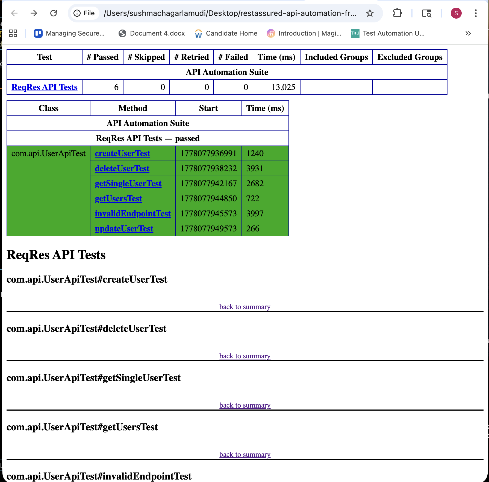

# SauceDemo UI Automation Framework

## Overview
This project demonstrates an end-to-end UI automation framework built using Selenium WebDriver, TestNG, and Maven.

It covers critical e-commerce workflows such as login, product selection, cart validation, and checkout.

---

## Tech Stack
- Java
- Selenium WebDriver
- TestNG
- Maven
- ChromeDriver

---

## Framework Design
- Page Object Model (POM)
- Explicit Waits (WebDriverWait)
- Reusable BaseTest setup
- Clean test structure

---

## Test Scenarios Covered

### 1. Login Test
- Valid login
- Invalid login validation

### 2. Checkout Flow Test
- Add product to cart
- Verify cart item
- Enter checkout details
- Validate pricing (item total, tax, total)
- Complete order

---

## Key Features
- Explicit waits for stable execution
- URL-based synchronization
- Handling browser popups (ChromeOptions)
- End-to-end automation flow
- Modular and reusable page classes

---

## How to Run

```bash
mvn clean test

## Test Execution Repor




